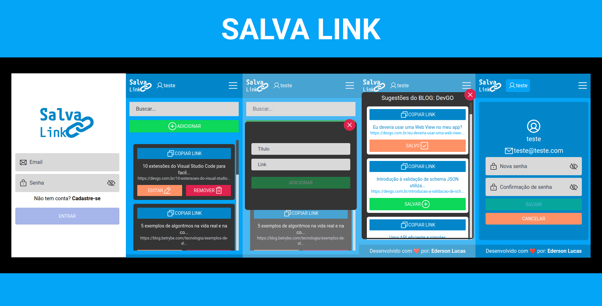
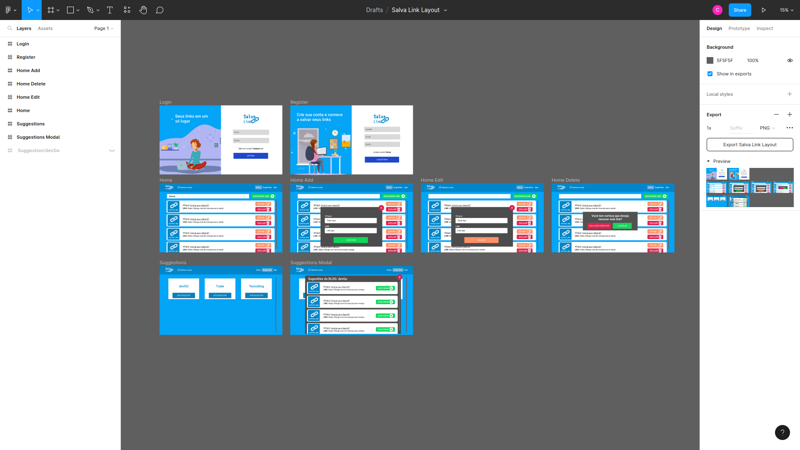
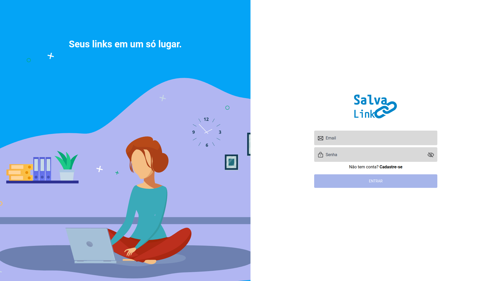
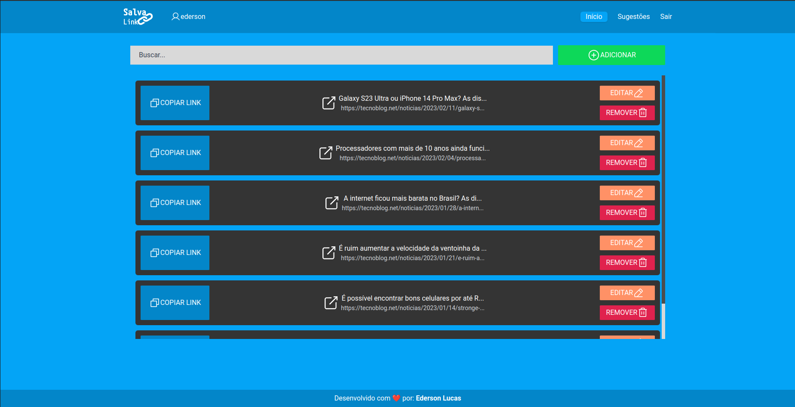
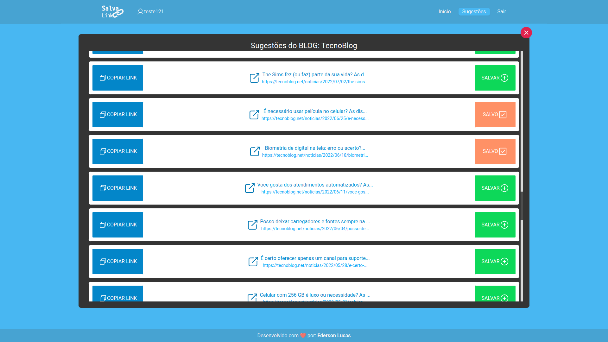
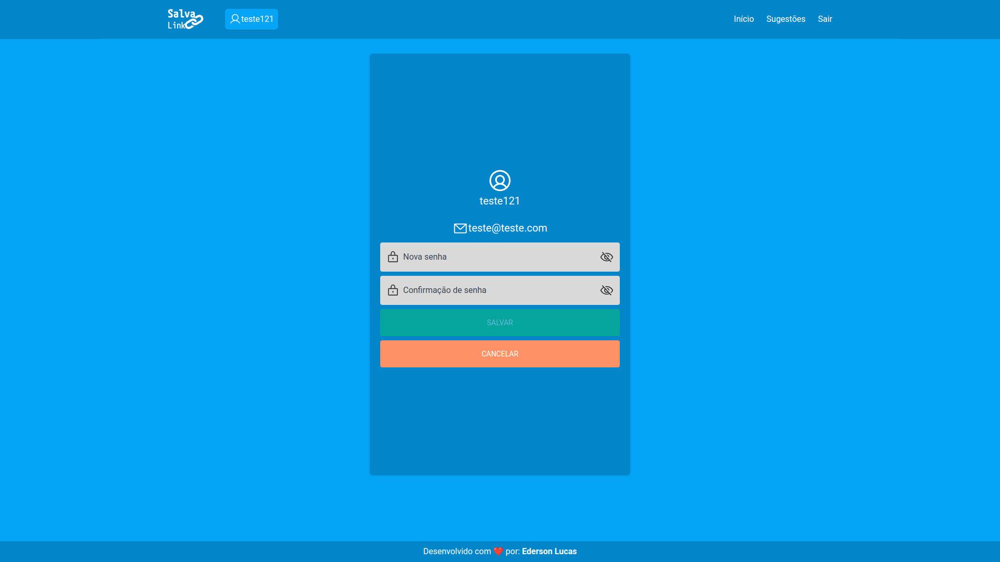
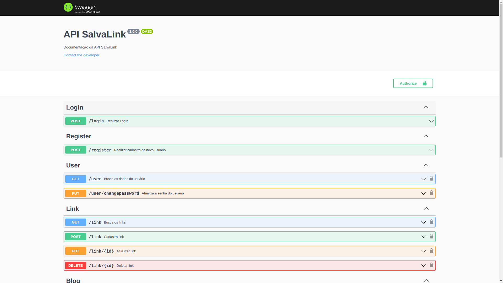
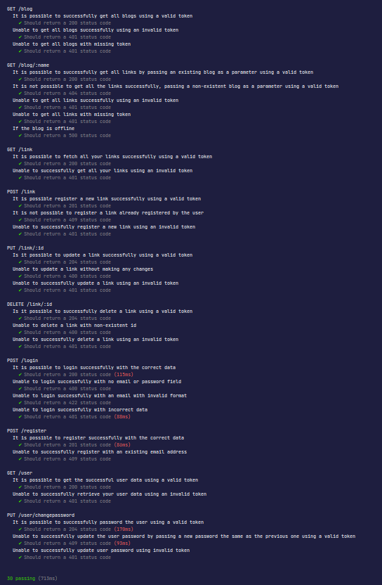
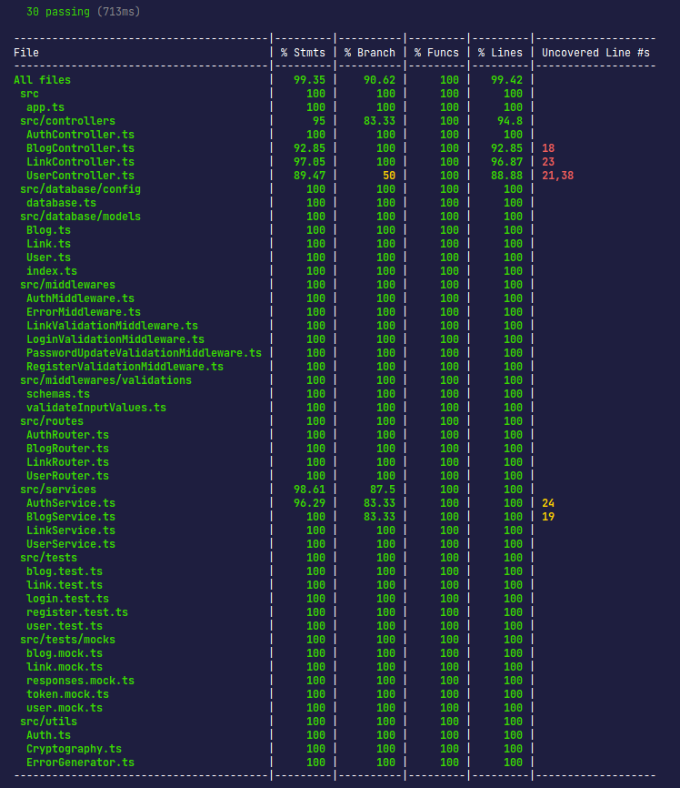

<h1 align="center">
    
    <br>
</h1>
<h4 align="center">
  Bem-vindo(a) ao repositório da aplicação Salva Link
</h4>


## 📋 Objetivo

O objetivo da aplicação é fornecer aos usuários uma maneira fácil e rápida de acessar os seus links favoritos. Em vez de ter que digitar manualmente o endereço URL ou procurá-lo na lista de favoritos, os usuários podem simplesmente clicar em um link salvo na aplicação. Além disso, a aplicação pode oferecer recursos adicionais, como a capacidade de copiar link, editar, remover, fazer buscas por algum termo que esteja no título ou no link, também tem 3 robôs que visitam 3 blogs diferentes para pegar suas últimas matérias sobre tecnologia como sugestões para o usuário salvar. O objetivo final é ajudar os usuários a economizar tempo e tornar a navegação na web mais eficiente e organizada.

#### Funcionalidades

- Cadastrar um novo usuário;
- Realizar login com usuário já existente utilizando validação de permissão de leitura, por meio de um token;
- **Logado no sistema o usuário conseguirá**:
  - Adicionar novos links;
  - Ver os seus links salvos;
  - Editar links existentes;
  - Remover links;
  - Salvar links de blogs sugeridos;
  - Filtrar por palavra que contenha tanto no link quanto no titulo;
  - Alterar sua senha.

## 🚀 Tecnologias Utilizadas

Esse projeto foi desenvolvido com as seguintes tecnologias:

- **Backend**
  - Express
  - Puppeteer
  - SequelizeORM
  - Mysql2
  - Banco de dados MySQL
  - Jwt
  - TypeScript
  - Bcrypt
  - Joi
  - Docker
  - Swagger-UI
  - Mocha
  - Chai
  - ESLint
  - Prettier
- **FrontEnd**
  - NextJS
  - TypeScript
  - TailwindCSS
  - Axios
  - Nookies
  - Jwt-decode
  - React Copy To Clipboard
  - ESLint
  - Phosphor-react
  - React-toastify
  - Animate.css
  - Docker

## [🏗️](https://emojiterra.com/pt/construcao/) Estrutura

O projeto está estruturado em duas pastas são elas: **frontend** e **backend**. Unidos usando o docker-compose.

🧑‍🎨**Link do figma criado por mim**: https://www.figma.com/file/EIKFLUcp8PrXvAFbVEWalk/Salva-Link-Layout?t=nUWxwn607tYajszY-0



🎲**Link do diagrama que fiz para o banco de dados no drawsql**: https://drawsql.app/teams/edersonlucas/diagrams/salva-link


## 🛠️ Como instalar

**#Clonar este repositório**

```
git clone https://github.com/edersonlucas/salva-link
```

**#Entre na pasta do projeto**

```
cd salva-link
```

**#Renomeie o arquivo ".env.example" que está na pasta raiz do projeto para ".env"**

### 🐋 Rodando com Docker

⚠️ **Atenção**: Você precisa ter o docker e o docker-compose instalados em sua máquina para rodar o projeto.

**#Rode o seguinte comando para subir os containers (Pode demorar alguns minutos ☕)**[](https://emojipedia.org/pt/café/)
```
docker compose up --build
```
🔴O comando **"docker exec -it backend /bin/sh"** serve para você se conectar com o terminal do container. Depois que já estiver conectado não precisa mais usar😉

**#Após isso você deve criar o banco de dados para isso, use os seguintes comandos:**

```
docker exec -it backend /bin/sh
npm run db:create
```

**#Se você precisar resetar o banco de dados pode usar o seguinte comando:**

```
npm run db:reset
```

**🧪Para executar os testes de cobertura do backend, use o seguinte comando:**

```
npm run test:coverage
```
### 👁Deploy da aplicação

**link:** https://salva-link.vercel.app/

**⚠️Atenção:** Ao acessar a aplicação você precisará fazer login ou criar uma conta. Você pode usar a conta abaixo. Por favor, não alterar a senha, mas se o fizer voltar a padrão. Obrigado**💜**

```
Email: teste@teste.com
Senha: teste123
```





### ⚠️ Documentação das rotas

**#Você pode abrir a documentação da API em:**

Documentação: https://salvalinkbackend.fly.dev/api-docs/



### 🧪 Testes




#### [🚨](https://emojiterra.com/pt/luz-giratoria/) Em caso de dúvida, entre em contato.

[Email](edersonlucas@outlook.com.br)

[Linkedin](https://www.linkedin.com/in/edersonlucas/)

---

Desenvolvido por: [Ederson Lucas](https://www.linkedin.com/in/edersonlucas/)
